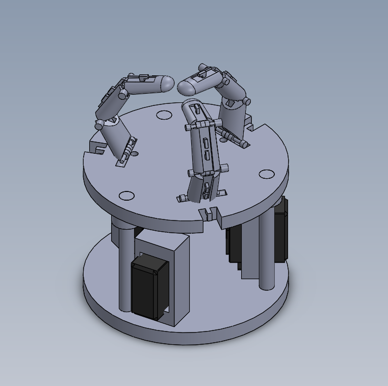
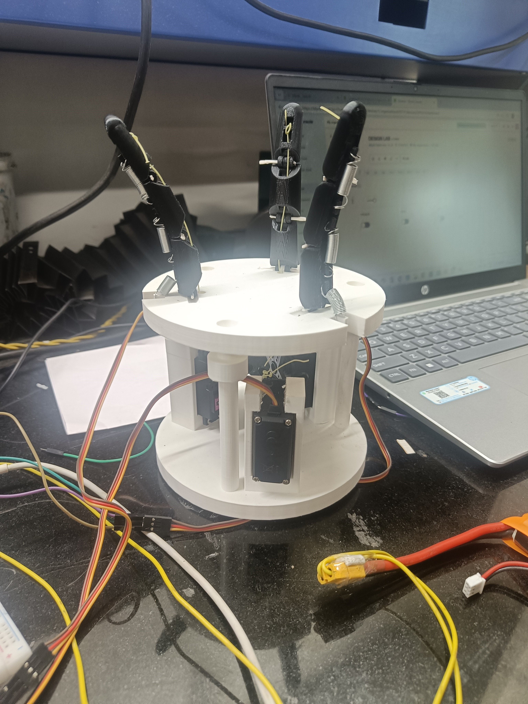

# Underactuated_Tendon-Driven_Robotic_Gripper

---

## Overview

Design and fabrication of an underactuated, tendon-driven robotic gripper developed
as part of the ME205 Design Lab-1 course at IIT Ropar.

The **Tri-Tendon Gripper** is a 3-finger robotic hand that uses only 3 MG996R servo
motors to control 9 degrees of freedom. Instead of dedicating one motor per joint,
each tendon drives an entire finger — making the system lightweight, energy-efficient,
and capable of adapting to different object shapes automatically.

**Course:** ME205 – Design Lab-1  
**Institution:** IIT Ropar (Indian Institute of Technology, Ropar)  
**CAD Software:** SolidWorks 2021  
**Guide:** Dr. Manish Agrawal

---

## Demo

[Watch Video Demonstration](Videos/Project_Showcase.mp4)

---

## Working Principle

- **Closing:** Servo motors pull the tendons, curling the fingers inward while
  elongating the return springs mounted at the back of each joint
- **Opening:** When the motor releases, the stretched springs contract and pull
  the fingers back to the open position (passive return)
- **Adaptive Grasping:** Since tendons are not fixed to a single joint, fingers
  automatically wrap around the object's shape without complex programming

---

## Mechanical Design

- 3-finger underactuated structure with 3 joints per finger (9-DOF total)
- Tendons attached to circular servo horns — displacement follows `d = r·sin(θ)`
- Variable spring stiffness across finger length produces a natural curling sequence
- Servos mounted at the base (not on fingers) to minimize moving mass
- Staggered motor start times prevent current spikes and finger collisions

---

## Electronics and IoT

- **Microcontroller:** Arduino Uno R4 WiFi
- **Control Interface:** Blynk IoT platform — mobile app sliders map to servo
  positions via Virtual Pins
- **Power:** DC-DC Buck Converter regulating supply to 6.0V, isolating motor
  current spikes from Arduino logic

---

## Files

| Folder/File | Contents |
|---|---|
| `CAD/` | SolidWorks part and assembly files (.SLDPRT, .SLDASM) |
| `PROJECT_REPORT.pdf` | Full project report |
| `Videos/` | Working model demonstration videos |
| `CAD/Final_Assembly_Photo.png` | CAD render |
| `Photos/` | Physical model photos |

---

## Skills Demonstrated

- CAD modelling and 3D-printed prototype fabrication
- Underactuated mechanism design
- Tendon-spring actuation system
- Arduino programming and IoT integration (Blynk)
- Power electronics and motor control
